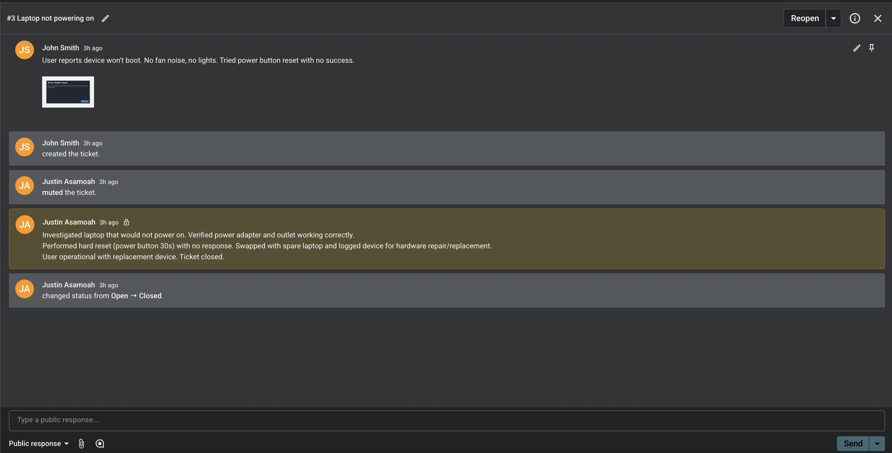
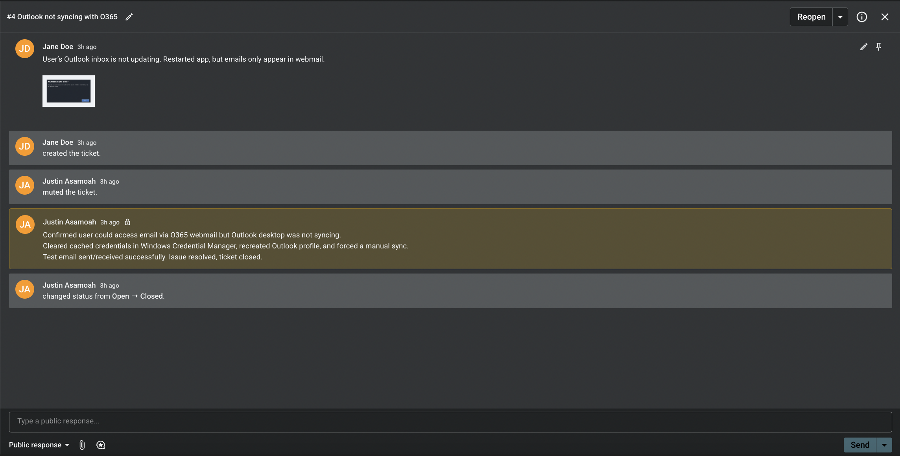
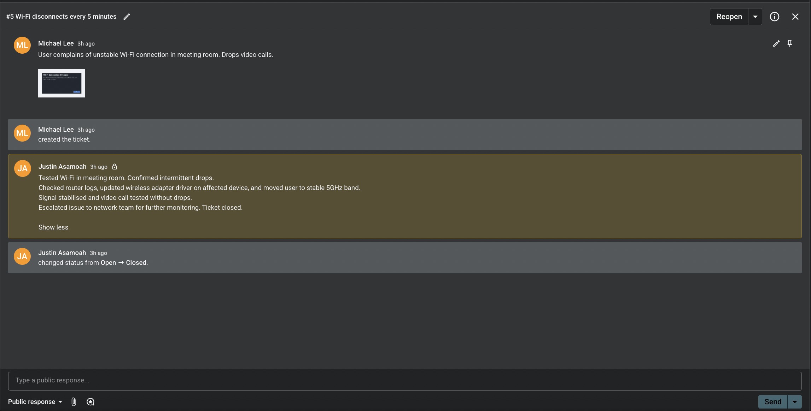
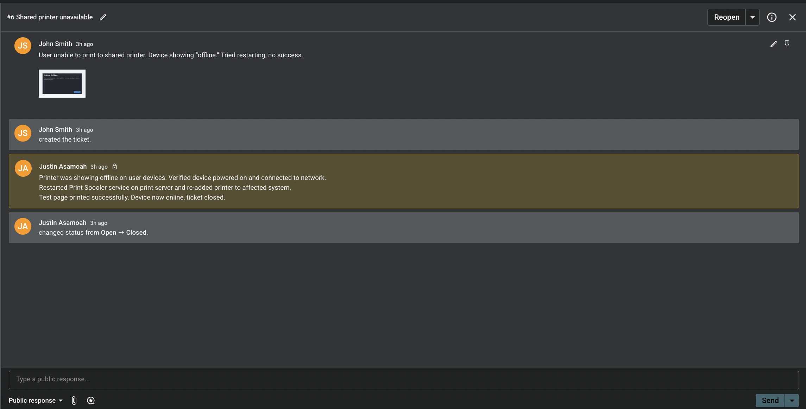
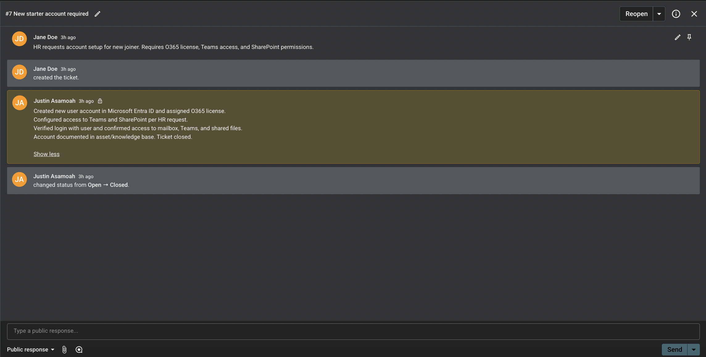

# IT Helpdesk Portfolio – Case Study Report

This repository contains my IT Helpdesk portfolio, a collection of case studies based on resolved IT support tickets.  
It demonstrates my skills in troubleshooting, documentation, communication, and resolution of technical issues across hardware, software, networking, and account administration.

---

## 📂 Contents
- **Case Studies (PDF)** – `IT_Helpdesk_Portfolio_Report.pdf`  
- **Editable Version (Word)** – `IT_Helpdesk_Portfolio_Report.docx`  

Each case study includes:
- Ticket summary  
- Issue description  
- Evidence (screenshots)  
- Actions taken  
- Resolution and outcome  

---

## 🛠️ Tools & Technologies
- **Spiceworks** – ticketing & helpdesk simulation  
- **Microsoft 365 / Entra ID** – account management and troubleshooting  
- **Windows OS** – client support and troubleshooting  
- **Networking** – Wi-Fi and connectivity issues  
- **Printers / Peripherals** – troubleshooting and spooler management  

---

## 🎯 Skills Demonstrated
- IT helpdesk ticket management  
- Hardware and software troubleshooting  
- Documentation and knowledge base updates  
- Communication with end users and third parties  
- Account setup and administration (Microsoft 365, Entra ID)  

---

## 📸 Screenshots

### Ticket Example – Laptop Not Powering On

### Ticket Example – Wi-Fi Disconnects

### Ticket Example – Outlook Sync Error

### Ticket Example – Printer Offline

### Ticket Example – New Starter Account Setup

---

## 📌 About
This project was created to simulate real-world IT Helpdesk scenarios and demonstrate readiness for IT Helpdesk Administrator roles.  
It serves as practical evidence of my ability to support end users, manage tickets, and resolve issues efficiently.  

---
